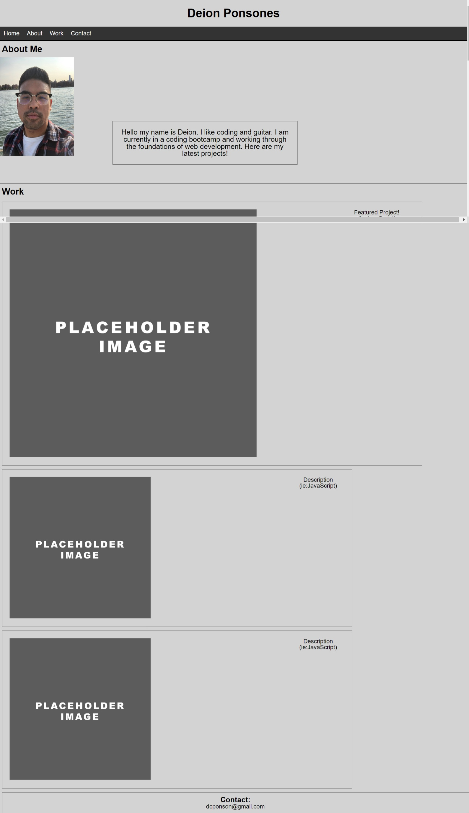

# 02 Advanced CSS: Portfolio

## Your Task

Using our current knowledge of HTML and CSS, this project focuses on making a portfolion website from scratch. The website should have a picture of me, sections to work / contact, working navigation bar, responsive to different screen sizes, and specified application layout. 

## Screenshot

## Links 

